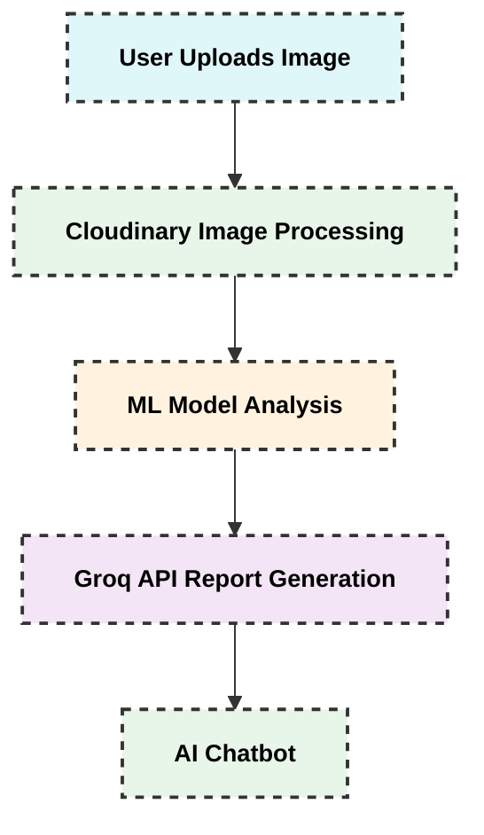

# DermaCare - 🏥 AI-Powered Skin Disease Diagnosis System

[](https://github.com/Sameeksha0329/DermaCare/blob/main/LICENSE)
[](https://skillicons.dev)

## 🌟 Overview
DermaCare is an advanced AI-powered skin disease diagnosis system that combines cutting-edge technologies to provide accurate skin condition diagnosis and comprehensive medical information. 🚀

## 🔄 Architecture



## 🎯 Key Features

1. **📸 Image Processing**
   - 🌟 Cloudinary integration for image optimization
   - 🔐 Secure cloud storage
   - 🎨 Automatic image enhancement

2. **🤖 AI Diagnosis**
   - 🧠 Custom ML model for skin condition detection
   - ⚡ Real-time disease identification
   - 📊 Severity assessment

3. **📄 Medical Reports**
   - 📖 Detailed reports via Groq API
   - 💊 Treatment recommendations
   - 🏥 Medication guidance

4. **💬 AI Chatbot**
   - 🤖 Personalized medical information
   - 🕒 24/7 support
   - 💊 Treatment advice

## 🛠️ Setup Instructions

### 📋 Prerequisites
- 🐍 Node.js (v16+)
- 📊 MongoDB
- 🌈 Cloudinary account
- 🤖 Groq API access

### 🔑 Environment Variables
Create a `.env` file in the Backend directory:
```
MONGODB_URI=your_mongodb_connection_string
CLOUDINARY_CLOUD_NAME=your_cloud_name
CLOUDINARY_API_KEY=your_api_key
CLOUDINARY_API_SECRET=your_api_secret
GROQ_API_KEY=your_groq_api_key
```

### 🚀 Installation

1. 🔧 Backend Setup
```bash
cd Backend
npm install
npm start
```

2. 🤖 ML Model Setup
```bash
# Windows 🪟
double-click start_ml_model.bat

# Mac/Linux 🐧
chmod +x start_ml_model.sh
./start_ml_model.sh
```

3. 🎨 Frontend Setup
```bash
cd frontend
npm install
npm start
```

## 📖 Usage

1. 📸 Upload a skin image
2. ⏳ Wait for ML analysis
3. 📄 View generated report
4. 💬 Use AI chatbot for questions

## 🎯 How It Works

1. **Step 1: Image Upload** 📸
   - Upload your skin image through the web interface
   - Cloudinary automatically processes and enhances the image
   - Image is securely stored in Cloudinary cloud storage

2. **Step 2: AI Analysis** 🤖
   - Our custom ML model analyzes the processed image
   - Disease identification and severity assessment
   - Results are sent to Groq API for comprehensive report generation

3. **Step 3: Report Generation** 📄
   - Detailed medical report is generated
   - Includes disease name, severity, treatment options, and prevention tips
   - Report can be downloaded or emailed

4. **Step 4: AI Chatbot Interaction** 💬
   - Click the chat icon in the bottom-right corner
   - Ask questions about your diagnosis, treatment options, or general skin health
   - Get personalized medical information based on your specific condition

## 🤝 Contributing

1. Fork the repository
2. Create your feature branch
3. Commit your changes
4. Push to the branch
5. Create a Pull Request

## 📄 License
This project is licensed under the MIT License - see the LICENSE file for details.

## 🙏 Acknowledgments
- 🌈 Cloudinary for image processing and storage
- 🤖 Groq API for medical information
- 🎨 React and Material-UI for frontend
- 🐍 Python and Node.js for backend
- 📊 MongoDB for data storage

## 🆘 Support
For support, please open an issue in the GitHub repository.

---

> 💡 **Tip:** Always consult with a qualified dermatologist or healthcare provider for proper diagnosis and treatment of skin conditions. This tool is meant to provide information and support, not replace professional medical advice.